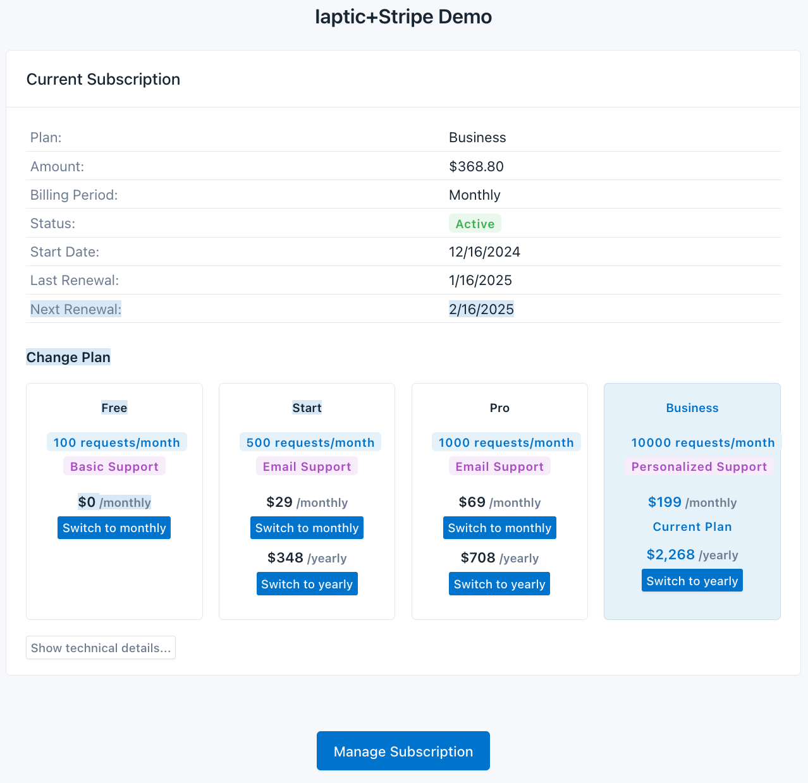

# iaptic-js-demo

[](LICENSE)
[](https://www.iaptic.com/documentation/iaptic-js)

This repository showcases a simple integration using [IapticJS](https://www.iaptic.com/documentation/iaptic-js) to manage subscriptions and one-time purchases with Stripe Checkout. It demonstrates how to:

• Display available products and prices from Stripe via [Iaptic](https://iaptic.com).  
• Create new subscriptions using Iaptic-provided interface to Stripe Checkout.  
• Manage subscriptions (change plan, cancel, etc.) via Stripe Customer Portal.  
• Retrieve and display existing subscription details.



---

## Table of Contents

1. [Overview](#overview)  
2. [Prerequisites](#prerequisites)  
3. [Installation](#installation)  
4. [Usage](#usage)  
5. [Project Structure](#project-structure)  
6. [Configuration](#configuration)  
7. [Troubleshooting](#troubleshooting)  
8. [Contributing](#contributing)  
9. [License](#license)

---

## Overview

iaptic-js-demo is designed to serve as a clear and concise starting point for developers who wish to incorporate IapticJS with Stripe in their web applications.

### Why Use This Demo?

• It provides an end-to-end sample (with minimal code) to quickly see how subscriptions are created and managed.  
• Offers a clean UI to showcase real-world usage of Stripe, driven through Iaptic's abstraction and integration points.

---

## Prerequisites

Before using this demo, please ensure you have the following:

• Node.js (version 14 or newer is strongly recommended)  
• An active Stripe account, along with the corresponding API keys (publishable and secret)  
• An Iaptic public API key and associated credentials  

To retrieve product and price data from Stripe via Iaptic, you will need to embed all required keys and credentials in their respective locations.

---

## Installation

1. Clone this repository:
   ```
   git clone https://github.com/iaptic/iaptic-js-demo.git
   ```
2. Navigate to the project directory:
   ```
   cd iaptic-js-demo
   ```
3. Install all dependencies:
   ```
   npm install
   ```
   or, if you prefer Yarn:
   ```
   yarn
   ```

---

## Usage

This project can be run by serving the files locally with a static server (using the "serve" package).  

Start the demo with:
```
npm run start
```
Then open the provided localhost URL in your browser (commonly http://localhost:3000 or an alternative port).

To launch a static server on port 4000:
```
npm run dev
```

---

## Project Structure

The key files included in this repository are:

• index.html / index.js  
  - The principal front-end experience. Utilizes IapticJS to fetch and display products, manage subscriptions, and interface with Stripe Checkout and Customer Portal.

• server.js  
  - A minimal Express application that serves static files of the project.

---

## Configuration

1. **Iaptic configuration**  
   - Configure Stripe API keys in [Iaptic](https://iaptic.com/settings). Check [iaptic documentation](https://iaptic.com/documentation/stripe) for more details.

2. **Client configuration**  
   - Provide your "stripePublicKey," "appName," and "apiKey" in credentials.js (copy credentials-example.js and replace with your own values).

---

## Troubleshooting

• If you see a CORS error explaining that your frontend cannot reach the Iaptic, ensure the Content-Security-Policy headers in your HTML allow requests to `validator.iaptic.com`.  
• If subscriptions or product data isn't showing, [make sure your Stripe products and prices are correctly setup](https://iaptic.com/documentation/stripe/how-to/configure-products).  
• Double-check that your credentials.js file is filled out correctly.

---

## Contributing

Contributions are welcome! To submit a pull request:

1. Fork this repository.  
2. Create a feature branch (e.g., `feature/my-new-feature`).  
3. Make changes, commit, and push to your fork.  
4. Open a Pull Request in this repository describing your changes.

---

## License

This project is licensed under the terms of the [MIT license](LICENSE).
